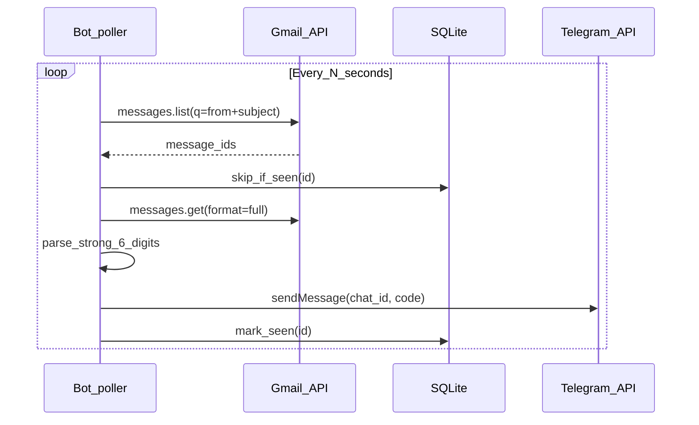

# Gmail → Telegram (6-digit code) bot

## Context

The repo today is an Express + Pug app in [`server.ts`](server.ts) with [`bun:sqlite`](server.ts) (`wow_db.sqlite`). There is **no** Telegram or Gmail integration yet. The bot should be a **separate entrypoint** (e.g. `bot.ts` or `src/bot.ts`) so the web server and the mail poller can run independently; both can share the same SQLite file for deduplication.

## Data flow

## Gmail access

- Use the **Gmail API** with **OAuth 2.0 (installed/desktop or web)** for the mailbox you monitor. Enable “Gmail API” in Google Cloud Console, create OAuth client credentials, complete a **one-time** auth flow to obtain a **refresh token**, then store `GMAIL_CLIENT_ID`, `GMAIL_CLIENT_SECRET`, `GMAIL_REFRESH_TOKEN` (and optionally `GMAIL_USER_EMAIL` if using domain-wide / fixed account) in env — **never commit** tokens; extend [`.gitignore`](.gitignore) if you add a token file.
- Search query: default to Kinopub’s verification mail — `from:support@kino.pub subject:"Проверочный код для кинопаба"` (Gmail `q` syntax). Still allow overrides via env (`GMAIL_FROM`, `GMAIL_SUBJECT`) so you are not hard-coding only in code if you prefer env-only config.

## Code extraction

- Fetch message with `format=full`, walk MIME parts for `text/html` (fallback: `text/plain` if no HTML).
- Decode `body.data` (base64url).
- Parse HTML and find **6 consecutive digits** inside a `<strong>...</strong>` element (e.g. with a small HTML parser or a careful regex on normalized HTML). Prefer **first match**; if zero or multiple ambiguous matches, log and optionally notify Telegram with an error line (your choice; default: skip + log).
- Normalize: strip tags inside `strong` if needed so `123456` is readable.

## Telegram

- Use **[grammy](https://grammy.dev/)** (`grammy` package): instantiate `Bot` with `TELEGRAM_BOT_TOKEN`, send the extracted code with `bot.api.sendMessage(chat_id, text)` (or `ctx` if you add a minimal command handler for `/start` to discover chat id).
- Env: `TELEGRAM_BOT_TOKEN`, `TELEGRAM_CHAT_ID` (private chat or group; user obtains chat id after `/start` or via BotFather flow).

## Deduplication and schema

- Reuse SQLite: create a small table e.g. `processed_gmail_messages(id TEXT PRIMARY KEY, processed_at INTEGER)` on startup (`CREATE TABLE IF NOT EXISTS`).
- Before sending, insert or ignore by Gmail `message.id`; only send when insert succeeds.

## Configuration (env)

| Variable             | Purpose                                                                 |
| -------------------- | ----------------------------------------------------------------------- |
| `GMAIL_FROM`         | Optional override; default **`support@kino.pub`**                       |
| `GMAIL_SUBJECT`      | Optional override; default **`Проверочный код для кинопаба`**           |
| `POLL_INTERVAL_MS`   | Poll interval (e.g. 30000)                                              |
| `TELEGRAM_BOT_TOKEN` | Bot token                                                               |
| `TELEGRAM_CHAT_ID`   | Destination chat                                                        |

Implementation note: build Gmail `q` as `from:<GMAIL_FROM> subject:"<GMAIL_SUBJECT>"` (quote the subject for spaces/Cyrillic).

## NPM/Bun dependencies

- **`googleapis`** — Gmail API + OAuth2 client with refresh token.
- **`grammy`** — Telegram Bot API.
- Optional separate script (e.g. `scripts/gmail-auth.ts`) using `googleapis` OAuth2 flow for the one-time refresh token exchange.

## Scripts

- Add `package.json` script e.g. `"bot": "bun run bot.ts"` (path TBD) for production-style runs alongside existing `"dev"` for the web app.

## Deliverables

1. New bot module + optional `scripts/gmail-auth.ts` (or inline README steps) for the one-time OAuth exchange.
2. Env example file (e.g. `.env.example` — only if you want it documented; you can instead document vars in README to avoid extra files per your prefs).
3. SQLite migration for `processed_gmail_messages` inside bot startup.
4. No change to Express routes unless you later want a health endpoint; keep scope to the bot worker.

## Risks / notes

- **Google OAuth verification**: personal/workspace use with “testing” users is fine; publishing the app is only needed for arbitrary Google accounts.
- **HTML variance**: if Kinopub (per repo name) changes markup, adjust the extractor; logging the raw snippet (redacted) helps debugging.
- **Rate limits**: conservative poll interval + processing only new ids keeps usage low.
